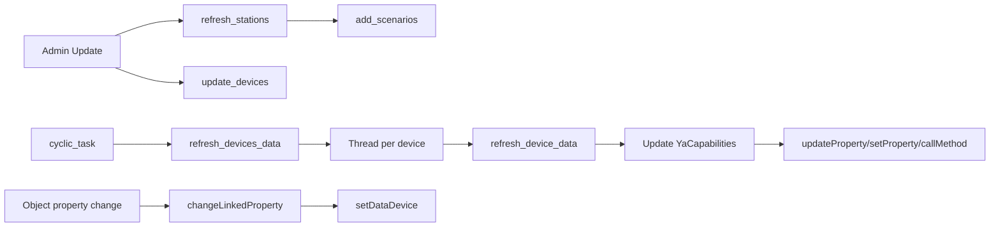

# YandexDevices - Technical Reference

## Module Structure

Core files:

| File | Responsibility |
| --- | --- |
| `plugins/YandexDevices/__init__.py` | Plugin lifecycle, admin routes, polling, linking, TTS actions |
| `plugins/YandexDevices/QuazarApi.py` | HTTP client for Yandex Quasar/Passport/OAuth interactions |
| `plugins/YandexDevices/models/YaStation.py` | Station model (`yastation`) |
| `plugins/YandexDevices/models/YaDevices.py` | Device model (`yadevices`) |
| `plugins/YandexDevices/models/YaCapabilities.py` | Capability link/value model (`yadevices_capabilities`) |
| `plugins/YandexDevices/forms/SettingForms.py` | Global module settings form |
| `plugins/YandexDevices/forms/StationForm.py` | Station edit form |
| `plugins/YandexDevices/templates/*` | Admin pages and widget |

---

## Runtime Overview



---

## Data Model

### `YaStation` (`yastation`)

| Field | Type | Meaning |
| --- | --- | --- |
| `id` | integer | Primary key |
| `title` | string | Station title |
| `platform` | string | Yandex platform id |
| `icon` | text | Icon URL |
| `ip` | string | Optional IP |
| `min_level` | string | Minimum level for `say()` |
| `station_id` | string | Station ID from online stats endpoint |
| `iot_id` | string | IoT ID mapped from device list |
| `device_token` | string | Local device token |
| `screen_capable` | integer | Has screen capability |
| `screen_present` | integer | Screen currently present |
| `online` | integer | Online flag |
| `tts_scenario` | string | Scenario ID used for cloud TTS |
| `tts` | integer | TTS mode (`0/1/2`) |
| `updated` | datetime | Last update |

### `YaDevices` (`yadevices`)

| Field | Type | Meaning |
| --- | --- | --- |
| `id` | integer | Primary key |
| `title` | string | Device title |
| `device_type` | string | Yandex type |
| `room` | string | Room name |
| `icon` | text | Icon URL |
| `iot_id` | string | IoT ID |
| `update_period` | integer | Per-device poll interval |
| `updated` | datetime | Last poll timestamp |

### `YaCapabilities` (`yadevices_capabilities`)

| Field | Type | Meaning |
| --- | --- | --- |
| `id` | integer | Primary key |
| `device_id` | integer | Parent `YaDevices.id` |
| `title` | string | Capability/property key |
| `value` | string | Last known value |
| `read_only` | integer | `1` read-only, `0` writable |
| `linked_object` | string | osysHome object name |
| `linked_property` | string | osysHome property |
| `linked_method` | string | osysHome method |
| `updated` | datetime | Last value update |

---

## Admin and HTTP Routes

### Admin page

`admin()` supports operations via query params:

- `op=auth` (with `type=qr|reset`)
- `op=update`
- `op=generate_dev_token&id=<station_id>`
- `op=edit&station=<id>` / `op=edit&device=<id>`
- `op=delete&station=<id>` / `op=delete&device=<id>`

Tabs:

- `tab=` stations
- `tab=devices` devices

### Blueprint routes

Defined in `route_index()`:

- `GET /YandexDevices/device/<device_id>` - returns device + capabilities JSON.
- `POST /YandexDevices/device` and `/YandexDevices/device/<device_id>` - updates links and per-device settings.

Both require admin permissions.

> [!WARNING]
> Frontend calls `/YandexDevices/delete_prop/<id>`, but this route is not defined in current backend source.

---

## Authentication and Tokens

`QuazarApi` implements:

1. QR flow (`getQrCode`, `confirmQrCode`) using Passport endpoints.
2. Cookie persistence in cache directory (`cookie`, `cookie_qr`).
3. CSRF extraction from `https://yandex.ru/quasar/iot`.
4. Generic request wrapper with retry logic for 403/error status.

Token paths:

- CSRF token for non-GET Quasar API calls.
- music OAuth token obtained via mobile OAuth endpoint.
- per-station device token via `https://quasar.yandex.net/glagol/token`.

---

## Discovery and Synchronization

### Stations

`refresh_stations()` calls:

```text
https://quasar.yandex.ru/devices_online_stats
```

Skips app-only platforms:

- `iot_app_android`
- `iot_app_ios`
- `alice_app_ios`

Then updates/inserts `YaStation`.

### Devices

`update_devices()` calls:

```text
https://iot.quasar.yandex.ru/m/user/devices
```

Then updates/inserts `YaDevices`, and tries to map stations by title or `quasar_info.device_id`.

### Scenario bootstrap

`add_scenarios()` ensures each station with `iot_id` has a TTS scenario:

- reads scenario list from `/m/user/scenarios`;
- matches scenario name through custom `yandex_encode/yandex_decode`;
- creates missing scenario with voice trigger and quasar action;
- stores scenario id into `station.tts_scenario`.

---

## Polling and Synchronization Flow

`cyclic_task()` executes once per second and triggers `refresh_devices_data()` when `get_device_data` is enabled.

`refresh_devices_data()`:

1. selects devices (all or only linked ones based on `update_linked`);
2. checks per-device/default poll interval;
3. starts one thread per device due for refresh;
4. waits for all threads to finish.

`refresh_device_data(device_id)`:

1. requests `GET /m/user/devices/<iot_id>`;
2. injects synthetic online property (`devices.online`);
3. upserts capability/property records into `YaCapabilities`;
4. updates linked property/method targets in osysHome;
5. sends WebSocket `updateDevice`;
6. updates `device.updated` even on failure (fail-safe touch).

---

## Capability Parsing Logic

### Capability keys

Generated from capability `type` plus `state.instance` or `parameters.instance` when available.

Examples:

- `devices.capabilities.on_off`
- `devices.capabilities.range.temperature`
- `devices.capabilities.color_setting.color`

### Property keys

Generated as:

```text
<property.type>.<property.parameters.instance>
```

Example:

- `devices.properties.float.temperature`

### Value normalization

- boolean values are converted to `0/1` for capability storage;
- color/scene structures may extract nested `id`;
- generic properties keep raw `state.value`.

---

## Linking Semantics

When polling receives a new value:

- if `linked_object + linked_property` exists:
  - capabilities path uses `updateProperty(...)`;
  - properties path uses `setProperty(...)`.
- if value changed and `linked_method` exists:
  - `callMethod(...)` is invoked with NEW/OLD value payload.

When osysHome property changes:

- `changeLinkedProperty(obj, prop, val)` finds matching `YaCapabilities`;
- calls `setDataDevice(...)` per match.

`setDataDevice(...)` currently posts an action with:

```json
{
  "actions": [
    {
      "type": "<capability title>",
      "state": {
        "instance": "on",
        "value": true
      }
    }
  ]
}
```

> [!CAUTION]
> Reverse control always uses `instance: "on"` in current implementation, so non-on/off capabilities may require backend extension for full correctness.

---

## SAY and Cloud TTS Internals

`say(message, level, args)`:

- iterates selected stations;
- filters by `tts` mode and `min_level`;
- for cloud mode (`tts=2`) calls `send_cloud_TTS`.

`send_cloud_TTS(station, message, action='phrase_action')`:

1. sanitizes and truncates message to 99 chars;
2. updates scenario via `PUT /m/v4/user/scenarios/<id>`;
3. triggers scenario run via `POST /m/user/scenarios/<id>/actions`.

Alternative action used by `send_command_to_stationCloud(..., command)`:

- `text_action`

---

## WebSocket

The module sends:

- `operation: "updateDevice"` with refreshed device record.

Frontend in `yandexdevices_devices.html` subscribes to `YandexDevices` and updates `Updated` column in real time.

---

## Dependencies

From local plugin files:

- `requests`
- `certifi`
- Flask / WTForms / SQLAlchemy runtime from core platform

---

## Known Caveats

- `send_command_to_station()` is stubbed (`pass`), local command path is not implemented.
- Station form labels `Local (not work)` explicitly indicates incomplete local TTS mode.
- `delProp` frontend action points to missing backend route.
- `update_period` is loaded in settings form but current POST save logic persists only `get_device_data` and `update_linked`.

---

## See Also

- [User Guide](USER_GUIDE.md)
- [Module index](index.md)
