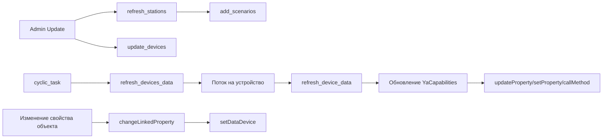

# YandexDevices - Техническая документация

## Структура модуля

Основные файлы:

| Файл | Назначение |
| --- | --- |
| `plugins/YandexDevices/__init__.py` | Жизненный цикл плагина, админ-роуты, опрос, привязки, TTS-действия |
| `plugins/YandexDevices/QuazarApi.py` | HTTP-клиент для Quasar/Passport/OAuth API Yandex |
| `plugins/YandexDevices/models/YaStation.py` | Модель станций (`yastation`) |
| `plugins/YandexDevices/models/YaDevices.py` | Модель устройств (`yadevices`) |
| `plugins/YandexDevices/models/YaCapabilities.py` | Модель значений и привязок (`yadevices_capabilities`) |
| `plugins/YandexDevices/forms/SettingForms.py` | Форма глобальных настроек модуля |
| `plugins/YandexDevices/forms/StationForm.py` | Форма редактирования станции |
| `plugins/YandexDevices/templates/*` | Админ-страницы и виджет |

---

## Архитектура выполнения



---

## Модель данных

### `YaStation` (`yastation`)

| Поле | Тип | Смысл |
| --- | --- | --- |
| `id` | integer | Первичный ключ |
| `title` | string | Название станции |
| `platform` | string | Идентификатор платформы Yandex |
| `icon` | text | URL иконки |
| `ip` | string | Опциональный IP |
| `min_level` | string | Минимальный уровень для `say()` |
| `station_id` | string | ID станции из `devices_online_stats` |
| `iot_id` | string | IoT ID (сопоставляется с device list) |
| `device_token` | string | Токен локального управления |
| `screen_capable` | integer | Поддержка экрана |
| `screen_present` | integer | Экран физически присутствует |
| `online` | integer | Признак online |
| `tts_scenario` | string | ID сценария для cloud TTS |
| `tts` | integer | Режим TTS (`0/1/2`) |
| `updated` | datetime | Время обновления |

### `YaDevices` (`yadevices`)

| Поле | Тип | Смысл |
| --- | --- | --- |
| `id` | integer | Первичный ключ |
| `title` | string | Название устройства |
| `device_type` | string | Тип устройства в Yandex |
| `room` | string | Комната |
| `icon` | text | URL иконки |
| `iot_id` | string | IoT ID |
| `update_period` | integer | Индивидуальный период опроса |
| `updated` | datetime | Время последнего опроса |

### `YaCapabilities` (`yadevices_capabilities`)

| Поле | Тип | Смысл |
| --- | --- | --- |
| `id` | integer | Первичный ключ |
| `device_id` | integer | Ссылка на `YaDevices.id` |
| `title` | string | Ключ capability/property |
| `value` | string | Последнее значение |
| `read_only` | integer | `1` только чтение, `0` доступно для обратной записи |
| `linked_object` | string | Имя объекта osysHome |
| `linked_property` | string | Свойство объекта |
| `linked_method` | string | Метод объекта |
| `updated` | datetime | Время последнего обновления |

---

## Админ-операции и HTTP-маршруты

### Админ-страница

`admin()` поддерживает операции через query params:

- `op=auth` (с `type=qr|reset`)
- `op=update`
- `op=generate_dev_token&id=<station_id>`
- `op=edit&station=<id>` / `op=edit&device=<id>`
- `op=delete&station=<id>` / `op=delete&device=<id>`

Вкладки:

- `tab=` станции
- `tab=devices` устройства

### Blueprint-маршруты

Определены в `route_index()`:

- `GET /YandexDevices/device/<device_id>` - JSON устройства и его capabilities.
- `POST /YandexDevices/device` и `/YandexDevices/device/<device_id>` - сохранение привязок и настроек.

Оба маршрута требуют прав администратора.

> [!WARNING]
> Во frontend есть вызов `/YandexDevices/delete_prop/<id>`, но в текущем backend-коде этот маршрут не реализован.

---

## Авторизация и токены

`QuazarApi` реализует:

1. QR-flow (`getQrCode`, `confirmQrCode`) через Passport.
2. Хранение cookie в cache (`cookie`, `cookie_qr`).
3. Извлечение CSRF из `https://yandex.ru/quasar/iot`.
4. Повтор запроса при ошибках/403 в `api_request`.

Пути токенов:

- CSRF-токен для non-GET вызовов Quasar API.
- music OAuth token через mobile OAuth endpoint.
- токен устройства станции через `https://quasar.yandex.net/glagol/token`.

---

## Обнаружение и синхронизация

### Станции

`refresh_stations()` вызывает:

```text
https://quasar.yandex.ru/devices_online_stats
```

Игнорируемые платформы:

- `iot_app_android`
- `iot_app_ios`
- `alice_app_ios`

Далее выполняется upsert в `YaStation`.

### Устройства

`update_devices()` вызывает:

```text
https://iot.quasar.yandex.ru/m/user/devices
```

После этого обновляется/создается `YaDevices`, и пытается связать станцию по title или `quasar_info.device_id`.

### Инициализация TTS-сценариев

`add_scenarios()` обеспечивает наличие сценария для каждой станции с `iot_id`:

- читает список сценариев из `/m/user/scenarios`;
- сопоставляет по имени через `yandex_encode/yandex_decode`;
- создает отсутствующий сценарий с voice-trigger и quasar action;
- сохраняет `scenario_id` в `station.tts_scenario`.

---

## Поток опроса и синхронизации

`cyclic_task()` выполняется раз в секунду и вызывает `refresh_devices_data()` при `get_device_data=True`.

`refresh_devices_data()`:

1. выбирает устройства (все или только связанные, если `update_linked=True`);
2. проверяет индивидуальный/дефолтный период опроса;
3. запускает по одному потоку на устройство, которое пора опрашивать;
4. дожидается завершения всех потоков.

`refresh_device_data(device_id)`:

1. запрашивает `GET /m/user/devices/<iot_id>`;
2. добавляет синтетическое свойство online (`devices.online`);
3. обновляет/создает записи `YaCapabilities`;
4. обновляет связанные свойства/методы osysHome;
5. отправляет WebSocket `updateDevice`;
6. обновляет `device.updated` даже при ошибке (защита от непрерывного повторного опроса).

---

## Логика разбора capability/property

### Ключи capability

Формируются из `type` + `state.instance` или `parameters.instance`.

Примеры:

- `devices.capabilities.on_off`
- `devices.capabilities.range.temperature`
- `devices.capabilities.color_setting.color`

### Ключи property

Формируются как:

```text
<property.type>.<property.parameters.instance>
```

Пример:

- `devices.properties.float.temperature`

### Нормализация значений

- boolean в capabilities преобразуется в `0/1`;
- для color/scene могут извлекаться вложенные `id`;
- для properties сохраняется исходный `state.value`.

---

## Семантика привязок

Когда опрос приносит новое значение:

- если есть `linked_object + linked_property`:
  - для capabilities используется `updateProperty(...)`;
  - для properties используется `setProperty(...)`.
- если значение изменилось и задан `linked_method`:
  - вызывается `callMethod(...)` с параметрами NEW/OLD.

Когда в osysHome меняется свойство:

- `changeLinkedProperty(obj, prop, val)` ищет совпадающие `YaCapabilities`;
- для каждой записи вызывает `setDataDevice(...)`.

`setDataDevice(...)` отправляет action такого вида:

```json
{
  "actions": [
    {
      "type": "<title capability>",
      "state": {
        "instance": "on",
        "value": true
      }
    }
  ]
}
```

> [!CAUTION]
> В текущей реализации обратное управление всегда отправляет `instance: "on"`, поэтому для части не on/off capability может потребоваться доработка backend-логики.

---

## SAY и cloud TTS внутри модуля

`say(message, level, args)`:

- перебирает станции;
- фильтрует по `tts` и `min_level`;
- для cloud-режима (`tts=2`) вызывает `send_cloud_TTS`.

`send_cloud_TTS(station, message, action='phrase_action')`:

1. очищает и обрезает сообщение до 99 символов;
2. обновляет сценарий через `PUT /m/v4/user/scenarios/<id>`;
3. запускает сценарий через `POST /m/user/scenarios/<id>/actions`.

Альтернативный action в `send_command_to_stationCloud(..., command)`:

- `text_action`

---

## WebSocket

Модуль отправляет:

- `operation: "updateDevice"` с обновленной записью устройства.

Frontend в `yandexdevices_devices.html` подписывается на `YandexDevices` и обновляет колонку `Updated` без перезагрузки страницы.

---

## Зависимости

По локальным файлам плагина:

- `requests`
- `certifi`
- Flask / WTForms / SQLAlchemy (из core-платформы)

---

## Известные нюансы

- `send_command_to_station()` пока пустой (`pass`), локальный path команд не реализован.
- В форме станции явно указано `Local (not work)`, что подтверждает незавершенный локальный TTS-режим.
- `delProp` во frontend вызывает отсутствующий backend-маршрут.
- `update_period` читается в форме настроек, но при POST сейчас сохраняются только `get_device_data` и `update_linked`.

---

## См. также

- [Руководство пользователя](USER_GUIDE.ru.md)
- [Индекс модуля](index.ru.md)
